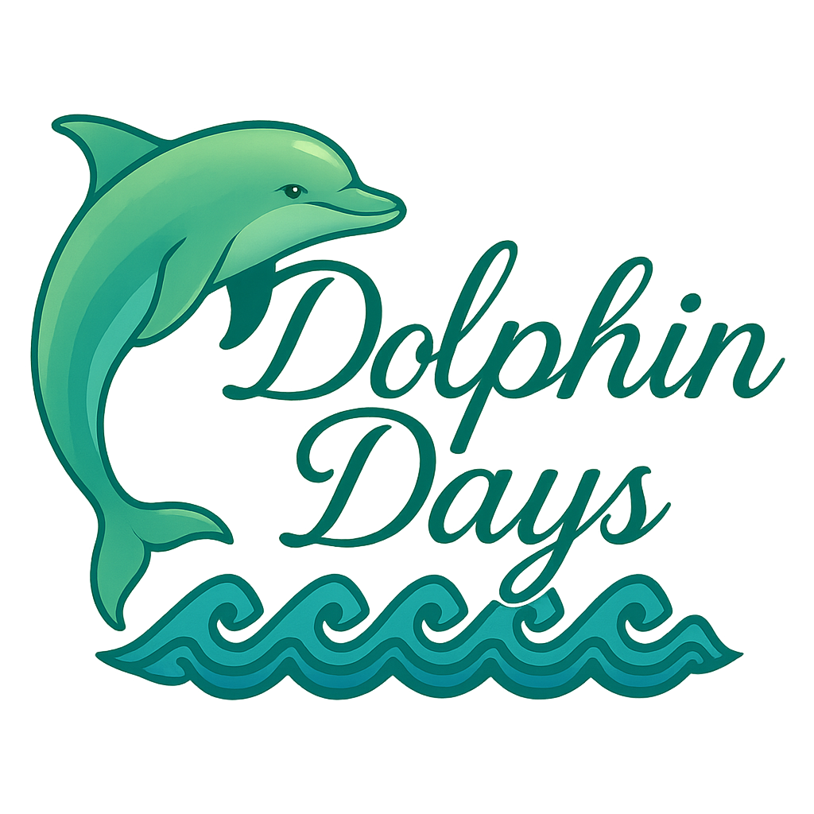

# 🐬 Dolphin Days

<p align="center">
  
  <a href="https://www.youtube.com/watch?v=xlLkMWvqyUU" target="_blank">
    
  </a>
</p>


**Dolphin Days** is a to-do list app designed to help you create and check off tasks throughout your day, all wrapped in a relaxing underwater theme. Featuring animated dolphins, soothing visuals, and an intuitive interface, Dolphin Days makes productivity a little more peaceful.

---

## 🚀 Getting Started

To get a local copy up and running, follow these simple steps.

### ✅ Prerequisites

- [Flutter SDK](https://flutter.dev/docs/get-started/install)
- A code editor like [VS Code](https://code.visualstudio.com/) or [Android Studio](https://developer.android.com/studio)
- An emulator or connected device for running the app

### 🔧 Installation

1. **Clone the repository**:
   ```bash
   git clone https://github.com/yourusername/dolphin_days.git
   ```

2. **Navigate to the project directory**:
   ```bash
   cd dolphin_days
   ```

3. **Install dependencies**:
   ```bash
   flutter pub get
   ```

4. **Run the app**:
   ```bash
   flutter run
   ```

---

## 📁 Project Structure

```plaintext
dolphin_days/
├── assets/
│   ├── images/
│   │   └── dolphins/
│   └── lotties/
├── lib/
│   ├── data/
│   │   ├── classes/
│   │   └── enums/
│   ├── features/
│   │   ├── aquarium/
│   │   └── calendar/
│   ├── utils/
│   └── views/
│       ├── pages/
│       └── widgets/
├── pubspec.yaml
```

---

## 🛠️ Built With

- [Flutter](https://flutter.dev/)
- [Dart](https://dart.dev/)
- [Material Design](https://m3.material.io/)

---
